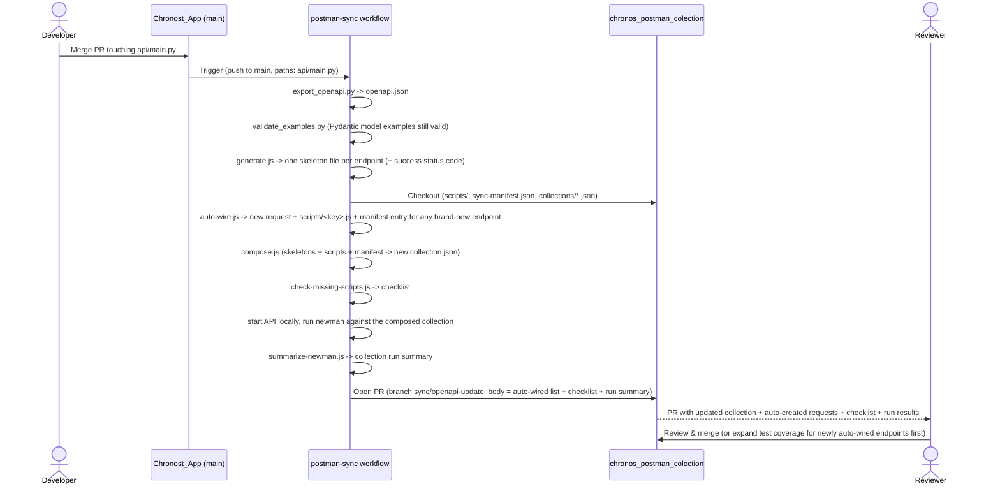

# Postman collection sync

Keeps the Postman collection in [chronos_postman_colection](https://github.com/jirivondra/chronos_postman_colection) in sync with the API's OpenAPI spec, without ever overwriting hand-written test scripts or unrelated requests (e.g. the `Errors` folder).

## Flow

If the live collection run fails, the PR still opens (so the diff is visible), but the workflow run itself is marked failed so it doesn't go unnoticed.

## Files

- `generate.js` — converts the exported OpenAPI spec into one skeleton request per endpoint (`<method>_<path>.json`), using the spec's `example` values (set via `model_config` on the Pydantic models in `api/main.py`) so a freshly wired-up request is directly usable, not full of `<string>` placeholders. Also reads each operation's declared success status code (e.g. `201` for Create, `204` for Delete) straight from the spec and attaches it as `_meta.successStatus`.
- `auto-wire.js` — for every endpoint `generate.js` produced that has **no** entry in the target repo's `sync-manifest.json` yet (a brand-new endpoint), automatically: writes a minimal `scripts/<key>.js` asserting the spec's declared status code, inserts a new request into the `Todos` folder (built from the skeleton, so it already has a realistic example body), and adds the `key -> name` mapping to `sync-manifest.json`. This only ever _creates_ — it never touches an existing manifest entry, request, or script, so the "never overwrite hand-written content" rule for existing endpoints still holds.
- `compose.js` — for each request name listed in `sync-manifest.json` (including ones `auto-wire.js` just added), syncs only `method` and the URL's path segments (translated into this collection's `{{param}}`-in-path convention) from the matching skeleton, and re-attaches the `prerequest`/`test` scripts from `scripts/<key>.js`. Everything else — `header`, `body`, and any request/folder not listed in the manifest — is left untouched.
- `check-missing-scripts.js` — flags endpoints with no manifest entry yet (a fallback, in case `auto-wire.js` couldn't wire one up), no script file yet, or whose example `body` fields have drifted from the spec's; the result becomes part of the PR body. It never changes `body` itself, since a field being "missing" can be intentional (e.g. a partial-update example) — a human always decides.
- `summarize-newman.js` — turns the JSON report from running the composed collection (via `newman`) against a live local instance of the API into a short pass/fail summary, appended to the PR body. This is the one check that verifies the collection actually _behaves_ correctly, not just that its shape matches the spec.
- `build-url.js` / `canonical-key.js` — shared helpers (URL construction and `<method>_<path>` key derivation) used by `generate.js`, `compose.js`, and `auto-wire.js`.
- `../api/validate_examples.py` — validates that the `example` on `TodoCreate`/`TodoUpdate` still passes the model's own validation, so `generate.js`'s output can't silently drift into an invalid example.

## Adding a new endpoint

This is now automatic — the moment an endpoint appears in the spec with no request wired up, `auto-wire.js` creates one with a basic status-code test. There's nothing to do beforehand; the sync PR itself has the new request ready to review. All you need to do afterward:

1. Review the auto-created request in the sync PR — check the example body, move it to a different folder if `Todos` isn't right
2. Expand its `scripts/<key>.js` test beyond the basic status-code check, if useful
3. Everything from then on (method/URL) stays in sync automatically, exactly like the other endpoints
