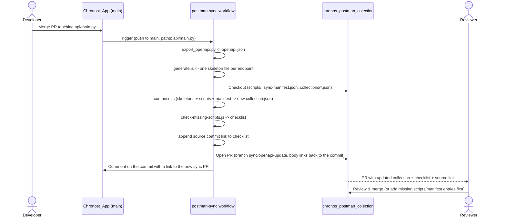

# Postman collection sync

Keeps the Postman collection in [chronos_postman_colection](https://github.com/jirivondra/chronos_postman_colection) in sync with the API's OpenAPI spec, without ever overwriting hand-written test scripts or unrelated requests (e.g. the `Errors` folder).

## Flow

The sync PR and its triggering commit link to each other, so you can jump from one to the other: the PR body ends with a `Source: <commit>` line, and the commit gets a comment with the PR URL as soon as it's opened.

## Files

- `generate.js` — converts the exported OpenAPI spec into one skeleton request per endpoint (`<method>_<path>.json`), using the spec's `example` values (set via `model_config` on the Pydantic models in `api/main.py`) so a freshly wired-up request is directly usable, not full of `<string>` placeholders.
- `compose.js` — for each request name listed in the target repo's `sync-manifest.json`, syncs only `method` and the URL's path segments (translated into this collection's `{{param}}`-in-path convention) from the matching skeleton, and re-attaches the `prerequest`/`test` scripts from `scripts/<key>.js`. Everything else — `header`, `body`, and any request/folder not listed in the manifest — is left untouched.
- `check-missing-scripts.js` — flags endpoints with no manifest entry yet (no request wired up), no script file yet, or whose example `body` fields have drifted from the spec's (missing a field that's now in the spec, or still sending one that's gone); the result becomes the PR body. It never changes `body` or scripts itself, since a field being "missing" can be intentional (e.g. a partial-update example) — a human always decides.
- `canonical-key.js` — shared `<method>_<path>` key derivation used by both `generate.js` and `compose.js`.

## Adding a new endpoint

The pipeline never invents new requests or folder placement — a human decides that once:

1. Run the workflow (or `generate.js` locally) to get the new endpoint's skeleton, already filled with realistic example data
2. Create the request in Postman using that skeleton, place it in the right folder, export and commit
3. Add an entry to `sync-manifest.json` in `chronos_postman_colection` mapping the endpoint key to the request's name
4. Optionally add `scripts/<key>.js` for its test script

From then on, that request's method/URL stays in sync automatically.
